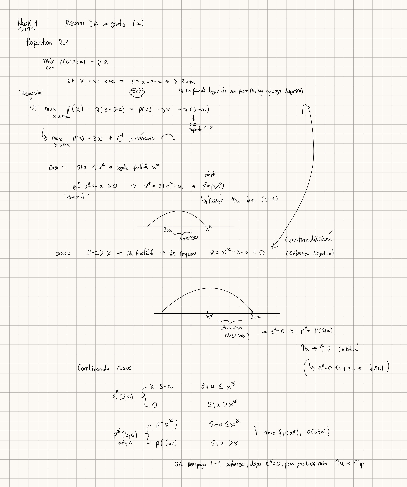

# Handwritten verification

`prop-2-1-case-split.jpg` is my own handwritten derivation of Proposition 2.1.
It rewrites the problem with total input `x = s + e + a`, derives the feasible
set `x >= s + a`, and treats both cases: for `s + a <= x*` effort fills the gap
(`e* = x* - s - a`, `p* = p(x*)`), and for `s + a > x*` reaching `x*` would need
negative effort (a contradiction), so `e* = 0` and `p* = p(s + a)`. Combining
the cases gives `e* = (x* - s - a)_+` and `p* = max{p(x*), p(s+a)}`.

**Verdict on the AI.** The AI's first-order-condition proof gave the right
formula but was **incomplete**: it assumed an interior solution and never
justified the corner `e = 0` or the largest-maximizer tie-break. The case split
above closes both gaps, so I verified rather than trusted the AI answer.
